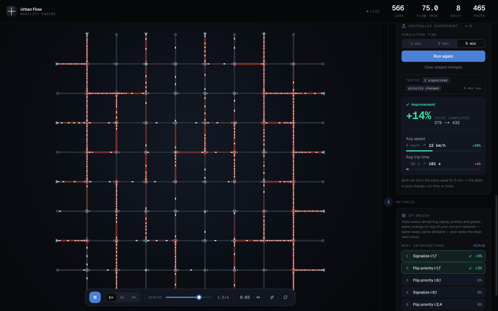

<h1 align="center">
  <br>
  
  <br>
  Urban Flow
  <br>
</h1>

<h4 align="center">A deterministic, agent-based traffic simulation you can experiment on — close roads, retune demand, watch the network reroute, then run controlled experiments (or let it auto-search) to find what actually helps.</h4>

<p align="center">
  
  
  
  
  
  
  
</p>

<p align="center">
  <a href="#-features">Features</a> •
  <a href="#-the-simulation-engine">Simulation Engine</a> •
  <a href="#-tech-stack">Tech Stack</a> •
  <a href="#ℹ%EF%B8%8F-how-to-run-the-application">How To Run</a> •
  <a href="#-license">License</a>
</p>

<p align="center">
  Not a video of traffic — a live system, simulated <strong>off the main thread</strong> in a Web Worker. A pure, seeded core (bit-for-bit reproducible) drives a hybrid Canvas 2D + WebGL visualization where roads, junctions and vehicles all speak one thermal language: <strong>cool = flowing, hot = congested</strong>. It opens on an <strong>8×8 district</strong> — legible enough that one change reads clearly — with a guided 60-second demo and the full <strong>12×12 metro</strong> one click away.
</p>

<p align="center">
  🔗 <strong>Live demo:</strong> <a href="urban-flow.marianacastro.dev/">urban-flow.marianacastro.dev</a>
</p>

<p align="center">
  
</p>

<br/>

## 🚗 Features

|                              |                                                                                                                                                                                                                              |
| ---------------------------- | ---------------------------------------------------------------------------------------------------------------------------------------------------------------------------------------------------------------------------- |
| **🚙 Agent-based cars**      | Every vehicle is an autonomous agent following the Intelligent Driver Model (IDM) — accelerating to its desired speed, keeping a safe headway, and queueing — with a stable integrator that never reverses and never overlaps. |
| **🧭 Shortest-path routing** | Cars are routed by Dijkstra over the lane graph to a destination, and **detour automatically** when a road ahead is closed.                                                                                                 |
| **🚦 Give-way & signals**    | Junctions resolve conflicts by strict-priority gap acceptance (unique ranks ⇒ deadlock-free), or switch — per junction, live — to a fixed-cycle traffic signal.                                                             |
| **🌊 Green-wave corridors**  | Coordinate a whole one-way arterial into a **green wave** — its signals phase-staggered by travel time so a platoon rides a wave of greens. Beats an isolated signal under load, and the optimizer can discover which corridor to coordinate.                                                          |
| **🧪 Scenario control**      | Close / reopen roads, drop incidents, retune demand per entry, choose destinations, and flip right-of-way. The network reroutes and re-settles in real time.                                                                |
| **⚡ One-click scenarios**   | Preset situations — _rush hour_, _close the artery_, _signalize the centre_, _green-wave the artery_ — each stage a fresh, same-seed network, ready to watch live or run an experiment on.                                   |
| **📊 Controlled A/B**        | Stage a change (a closure, a signal…), then run baseline vs. your change on two **same-seed** worlds for the same duration — so the impact on trips, speed and travel time is _your change_, not elapsed time or noise. Runs headless; a fast-forward skips the wait for traffic to build.                                                              |
| **🔎 Auto-optimizer**        | Let the simulation search for you: it sweeps every fix (signalize / flip priority / green-wave a corridor) as a controlled **same-seed** experiment — **fanned out across a Web Worker pool** — ranks them by throughput, and surfaces a **leaderboard of what actually helps**. Click a result to stage it on the live network and confirm it with the A/B.                                             |
| **🌡️ Living thermal map**    | Roads, junctions, flow and cars share one heat language: congestion warms the mesh, an always-on flow field shows each street's direction without cars, and critical junctions glow.                                         |
| **🎯 Focus & inspect**       | Click any road, junction **or car** to spotlight it — the rest of the network recedes — and read its live stats: cars, speed, queue length, signal phase. Select a car and its **Dijkstra route** lights up all the way to its exit.                                                                                                                   |
| **📈 Live metrics**          | A top-bar HUD with rolling **sparklines** for throughput and speed, so the network's dynamics read over time — not just as a single number.                                                                                 |
| **🖥️ Built to scale**        | The agent layer renders through **WebGL2 instancing** — one draw call for the whole fleet — over the Canvas 2D thermal map, cutting the frame's render cost ~10× at scale. The plain-data core is what lets both the renderer and the optimizer's worker pool consume it directly.                                                                     |
| **🧵 Off-main-thread engine** | The live simulation runs in a **Web Worker** — the UI can never block it, and it keeps advancing even in a backgrounded tab (worker timers aren't `requestAnimationFrame`-throttled). Every experiment crosses the boundary as a **typed, confirmed command**; the main thread renders only the state the worker confirms, so there is no second simulation to drift. |
| **🗺️ Pick your scale**       | Opens on a legible **8×8 district**, with the full-scale **12×12 metro** (144 junctions) one prominent click away as a **showcase**. Swap the whole grid any time; same seed, same engine, so you read how scale _alone_ bends the flow. |
| **🎓 Guided demo**            | A 60-second onboarding that _shows_ instead of tells: it coordinates a corridor into a **green wave**, runs the controlled A/B, and reveals the lesson — coordinating a corridor (**+~22% speed**) beats adding one signal (**−~10% speed**). You learn a real traffic-engineering idea, not just where the buttons are. |
| **♻️ Deterministic & tested** | Same world + same seed → identical run, bit for bit. The pure engine (IDM, routing, give-way, signals) — and the worker command protocol — are fully unit-tested with Vitest.                                               |

<br/>

## 🧠 The simulation engine

Urban Flow runs on a **pure, framework-free core** (`src/engine/`) — plain-data structs and free functions, no DOM and no React — wrapped by a thin Canvas + React shell. The core is a fixed-step, deterministic simulation whose every tick is a fixed pipeline ([`src/engine/simulation.ts`](src/engine/simulation.ts)):

```
tick(world):
  FASE S  updateSignals   advance every traffic-signal phase
  FASE 0  spawn           inject demand (seeded Bernoulli arrivals)
  FASE 1  accelerations   IDM, read-only — order-independent
  FASE 2  integrate       ballistic step, front → back per lane
  FASE 3  advance         cross junctions + despawn (record metrics)
```

- **Deterministic by construction** — fixed `dt = 0.2s`, a seeded `mulberry32` PRNG, fixed iteration order, and a two-phase _read-all-then-write-all_ update. Same world + same seed → identical state, so the core is testable offline with fixtures — and it powers the **controlled A/B**: baseline and intervention run on two same-seed worlds for the same duration, so the delta is the change, not time or noise. The **optimizer** cashes the same property in at scale, sweeping every candidate intervention headless against one shared baseline to rank what helps.
- **Structure-of-Arrays** — agent state lives in typed arrays (cache-friendly). The renderer packs them straight into a WebGL instance buffer, and the plain-data scene config is what lets the optimizer's sweep fan out across a **Web Worker pool** — same seed in, same result out, in parallel.
- **Car-following (IDM)** — `idmAcceleration` is the pure Intelligent Driver Model; `integrate` uses a ballistic scheme with a stop-handling branch so a car brakes to rest _within_ a step instead of reversing, plus an overlap guard against the car ahead.
- **The no-overtaking invariant** — with a single lane per direction, cars never reorder within a lane, so the per-lane ordered list is only ever mutated at the back (entry) and front (exit). That is the subtle correctness core that keeps the network provably overlap-free without any sorting.
- **Give-way** — strict-priority gap acceptance: a movement yields only to a strictly-higher-rank conflicting movement that has an approaching car. Ranks are unique per node, so the top movement never yields ⇒ **no deadlock**.
- **Routing** — Dijkstra with a binary min-heap over the lane graph; routes are per-OD (a shared, append-only buffer) and detour around closed lanes.
- **Scenario overlay** — closures, incidents, priority flips and signals are a flat typed-array overlay on top of the immutable graph. The defaults reproduce the plain network exactly, so the whole experimentation layer never touches — or risks — the tested core.

<br/>

## 🧰 Tech Stack

<p>
  
  
  
  
  
  
  
</p>

| Category            | Technologies                                                              |
| ------------------- | ------------------------------------------------------------------------- |
| **Framework**       | Next.js 16 (App Router), React 19                                         |
| **Language**        | TypeScript 5                                                              |
| **Styling**         | Tailwind CSS v4                                                           |
| **Rendering**       | Hybrid — Canvas 2D thermal chrome + **WebGL2 instanced** agent layer (raw, no rendering libraries) |
| **Simulation core** | Framework-free TypeScript (Structure-of-Arrays typed arrays, seeded PRNG) |
| **Testing**         | Vitest                                                                    |
| **Tooling**         | ESLint                                                                    |

<br/>

## 📝 Project Description

Urban Flow is an agent-based urban-traffic simulation built around a strict separation: a **pure, deterministic functional core** and an **imperative Canvas + React shell**. All simulation logic lives in `src/engine/` as plain-data structs and free functions with no framework dependency; the render layer (`src/render/`) maps the engine's metric / topological world to pixels; and a single client component (`src/components/`) runs the fixed-step loop and the UI.

The world is a procedurally generated one-way Manhattan grid: cars enter at the perimeter, are routed by shortest path to an exit, and give way (or obey signals) at each junction as they cross the network. On top of that sits a live **experimentation layer** — everything you can change (close a road, stage an incident, retune demand, pick destinations, flip priority, add signals) is applied as a flat overlay on the immutable graph, so the network reroutes and re-settles in real time without ever rebuilding or touching the tested core.

The visualization treats the mesh as a **living thermal field** rather than a diagram: one colour language (cool = flowing → hot = congested) runs through the roads, the junctions, an ambient flow field and the cars, so you can read where the system is under load without looking at a single number. Selecting any element spotlights it and its immediate topology while the rest of the network recedes.

The architecture, the tick pipeline and every design decision are documented in [`docs/DESIGN.md`](docs/DESIGN.md), with the incremental build history in [`docs/PROGRESS.md`](docs/PROGRESS.md).

<br/>

## 🛠️ Engineering challenges

The hardest part was **correctness under a moving target** — keeping the network provably overlap-free _and_ deterministic while agents spawn, follow, cross junctions and despawn on every tick. The two-phase (read-all-then-write-all) update, the ballistic integrator's stop branch, and the per-lane ordered list (mutated only at its ends) are what make _no reversing, no overlap, bit-for-bit reproducible_ hold — properties I could only trust by unit-testing the pure core in isolation with fixed seeds.

The second challenge was visual. Once the mesh became a live heat map, the individual vehicles started dissolving into the road glow — so the agents were lifted into their own luminance tier (a bright, dark-separated capsule with a near-white nose) to stay pickable at a glance without breaking the elegance of the system-level view.

The third was turning determinism from a _correctness_ property into a _product_ one — from "the run reproduces" to "the model can decide." A single reproducible run is table stakes; the payoff is comparison. The controlled A/B uses it directly — baseline vs. change on two same-seed worlds for the same duration, so the only variable is the change — and the **optimizer** pushes it to the limit, sweeping every candidate intervention as its own controlled experiment and ranking them by throughput. The work was making that both honest and responsive: measure every candidate against **one shared baseline** (so ~50 fixes cost ~51 headless runs, not ~100), and drive the sweep in chunks off `setTimeout` so it streams live progress, never blocks the frame loop, and still finishes in a throttled background tab — where a `requestAnimationFrame` loop would stall.

The fourth was **the scale leap — and it started by refusing to guess where the wall was.** Profiling said compute wasn't it: the deterministic core runs **~1500× under its realtime budget** (~0.13 ms/tick at hundreds of agents). The real limits were the *render* — the per-car Canvas 2D draw dominated the frame — and the *main thread* itself: a `requestAnimationFrame` loop stalls in a backgrounded tab and can be blocked by the UI. So the response was **architectural, not a micro-optimization.** The agent layer moved to **WebGL2 instancing** — one draw call for the whole fleet, ~10× cheaper at scale. The live simulation moved **off the main thread into a Web Worker**, publishing render state as a **transferable** buffer each tick (no copy, no `SharedArrayBuffer`, so no cross-origin-isolation headers) — the UI can never block it, and it keeps running when the tab is backgrounded. The optimizer's sweep **fans out across a worker pool**. The subtle part was letting the whole *interactive* layer follow the sim across that boundary without losing determinism or a single source of truth: a **typed command protocol**, each mutation confirmed incrementally, with the main thread holding only a **display mirror** of the worker's authoritative world — never a second simulation. Running off-thread is the default; `?main` opts back into the main-thread loop (and is the automatic fallback where `Worker` is unavailable).

<br/>

## ℹ️ How to run the application?

> The app is fully client-side — no database, API keys, or environment setup required.

> Clone the repository:

```bash
git clone https://github.com/maricastroc/drive-simulation
```

> Install the dependencies:

```bash
npm install
```

> Start the dev server:

```bash
npm run dev
```

> Run the tests:

```bash
npm run test
```

> ⏩ Access [http://localhost:3000](http://localhost:3000) to view the simulation.

<br/>

## 📄 License

Released under the [MIT License](LICENSE). You're free to use, study, fork and build on this code — **as long as the original copyright and license notice are kept**. Reuse it and learn from it; don't strip the attribution and present it as your own.

© 2025–2026 Mariana Castro

<br/>

<div align="center">

⭐ If you like this project, give it a star on GitHub!

</div>
